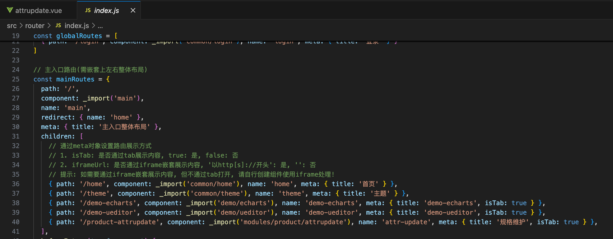
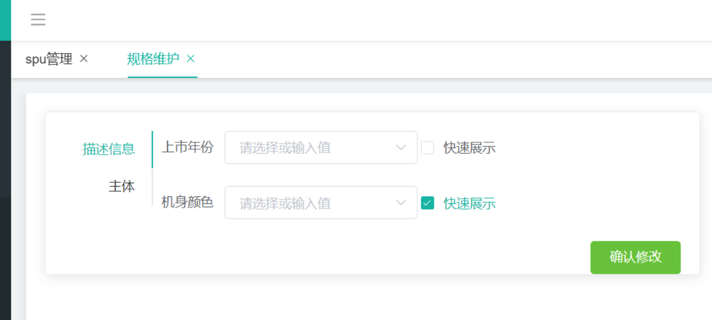
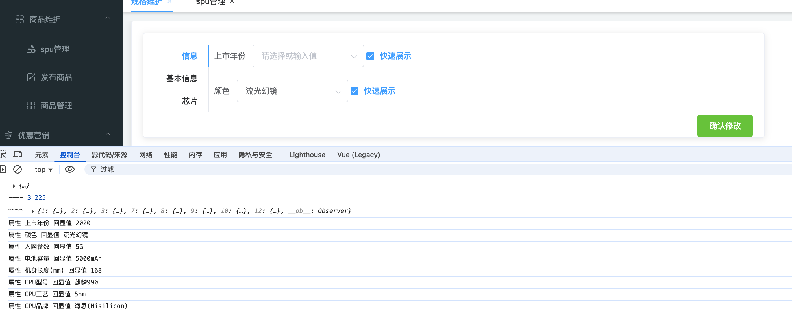

## **P100. 点击规格后页面报400错误以及数据不回显**

### 1.400报错

在 Vue 项目中，**所有可访问的页面必须注册为路由**，否则 Vue 根本就不知道这个路径该加载哪个组件，用户访问这个路径时就无法展示页面。


#### **两种路由注册方式：**

##### (1) 前端静态注册(写死在 router/index.js)

```
{ path: '/product-attrupdate', component: _import('modules/product/attrupdate'), name: 'attr-update', meta: { title: '规格维护', isTab: true } } 
```



##### **(2)后端动态注册（根据菜单接口注册）**


### 2.数据不回显：

解决了400报错，规格维护页面可以正常显示了，但却发现页面的数据没有回显



查看控制台，后端返回的数据没有异常，初步判断为前端问题

#### activated钩子(/src/views/modules/product/attrupdate.vue)

```js
activated() {
	this.clearData();
	this.getQueryParams();
	if (this.spuId && this.catalogId) {
    this.showBaseAttrs();
		this.getSpuBaseAttrs();
	}
}
```

导致showBaseAttrs()函数执行时，this.spuAttrsMap 还是空的

#### 解决方案

调整调用顺序，确保先获取spuAttrsMap数据后，再调用showBaseAttrs()

```js
activated() {
  this.clearData();
  this.getQueryParams();
  if (this.spuId && this.catalogId) {
    this.getSpuBaseAttrs()
      .then(() => {
        this.showBaseAttrs();
      });
  }
}
```

让getSpuBaseAttrs()返回一个Promise

```js
getSpuBaseAttrs() {
  return this.$http({
    url: this.$http.adornUrl(`/product/attr/base/listforspu/${this.spuId}`),
    method: "get"
  }).then(({ data }) => {
    data.data.forEach(item => {
      this.spuAttrsMap["" + item.attrId] = item;
    });
    console.log("~~~~", this.spuAttrsMap);
  });
},
```

调整过后重新测试



发现部分数据可以回显，但仍有数据无法回显。通过控制台打印信息可以知道，已经成功获取到了所有需要回显到数据

通过排查，发现不回显的值存在一个特点：


它们的值类型为可多选


当回显值只有一个值时无法回显，有多个值时可正常回显

所以问题出在对属性值的处理上，当值类型为多选值且只有一个值时

```js
if (v.length == 1) {
	v = v[0] + "";
	console.log("属性", attr.attrName, "回显值", v);
}
```

只有一个值的多选项也应该保持为数组状态，但在经过这个if条件判断后，误将其扁平化处理（从数组转成字符串），因此该属性值无法正常回显

#### 解决方案

```js
if (v.length == 1 && attr.valueType == 0) {
  v = v[0] + "";
  console.log("属性", attr.attrName, "回显值", v);
}
```

**只有当该属性是单值输入类型（valueType==0）并且回显值数组长度为1时**，才会把数组转成字符串
